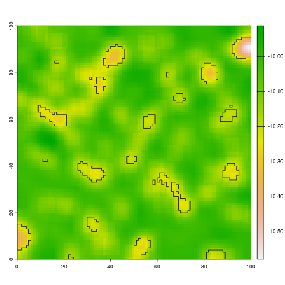

# HideyHole

Code to find small holes in a digital elevation model raster.

The code works by comparing pixel elevations against pixels in a local neighbourhood. pixels that are a chosen value below the average height in this neighbourhood are considered 'hidey holes'. The important tuning parameters are the size of the neighbourhood window (parameter neighbourhood) and the minimum and maximum hole sizes (parameters min.pixel and max.pixel).  These require exploration for your grid.

You can install the development version of HideyHole from GitHub with:
```r
# install.packages("devtools")
devtools::install_github("cyesson/TowedCameraTools")
```

Example
```r
# load your terra raster grid
data(TestGrid)
# run the hole finder with the default parameters
h<-HideyHole(TestGrid)
# plot the original grid
plot(TestGrid)
# overlay the holes we've found
plot(h$HideyHoleVector, add=T)
```

